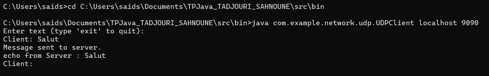
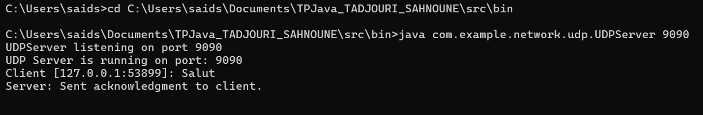
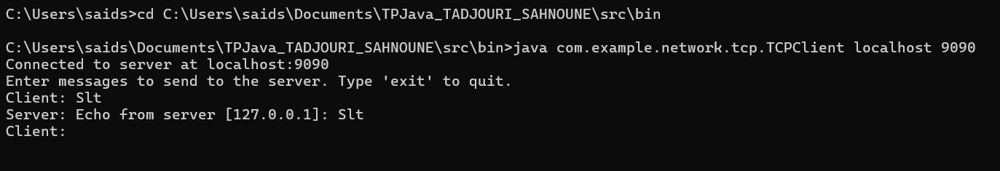
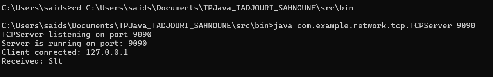
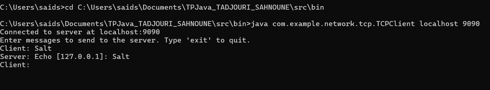
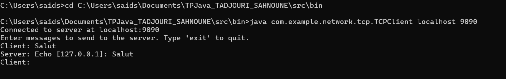

UDP Server/Client  
# UDP/TCP Chat App with Java sockets  
This lab project is a chat application developed in Java that uses sockets to enable communication between a client and a server. The lab covers setting up network communication using UDP and TCP protocols and managing multiple client connections through a multithreaded TCP server.

## Prerequisites ##
* A Java development Kit (JDK)
* A Java development environment (here we used Visual Studio Code)
* A Machine running Windows, Linux ect (We worked on Windows)

## Main Features 
### 1. **TCP Communication**
- **Standard TCP Server**: Handles a single client connection at a time.
- **TCP Client**: Connects to a TCP server and sends/receives messages.

### 2. **Multi-Client TCP Server**
- A server capable of handling multiple client connections simultaneously using dedicated threads.

### 3. **UDP Communication**
- **UDP Server**: Listens for datagrams sent by clients.
- **UDP Client**: Sends datagrams to a server.

## Project Organization
### **Packages**
- The project is organized into packages for better readability and modularity:
  - **`main`**: Contains the `Main` class to choose the execution mode.
  - **`tcp`**: Contains TCP-related classes(TCPServer, TCPMultiServer, TCPClient).
  - **`udp`**: Contains UDP-related classes(UDPServer, UDPClient).
  - **`threads`**: Contains utility classes for thread management(ConnectionThread).

# How to Compile and Run
## **Compilation without .jar file**
To compile all classes with their package structure, follow these steps:
* Navigate to the src directory with cd
* Compile the classes into the bin directory: Use the following command to compile all classes within the package structure: javac -d bin com/example/network/**/*.java
* If the above command does not work, you can compile each package separately. For example: javac -d ../bin com/example/network/tcp/*.java
javac -d ../bin com/example/network/udp/*.java
javac -d ../bin com/example/network/main/*.java
* You can directly execute the compiled classes using the java command. Ensure you are in the bin directory or specify its path.
* Run a specific class: java com.example.network.tcp.TCPServer [numéro de port]

### **1 – Creating a UDP Client-Server**  ###

* UDPServer.java: UDP server that listens for messages from clients and displays them along with the client's address.
* UDPClient.java: UDP client that reads user input and sends messages to the UDP server.

How to run:

1. Run the application: Start the UDP server on a specific port (java UDPServer 9090) and in an other terminal, run the UDP client (java UDPClient localhost 9090) and send messages.

Here are the terminal screenshots:

### **2 – Creating a TCP Client-Server** ###

* TCPServer.java: A basic TCP server that handles one client at a time.
* TCPClient.java: A client that establishes a TCP connection and exchanges messages with the server.

How to run:
2. Run the application: Start the TCP server on a specific port (java TCPServer 9090) and in an other terminal, run the TCP client (java TCPClient localhost 9090) and send messages.

Here are the terminal screenshots:

### **3 – Server accepting multiple TCP connections** ###

* TCPMultiServer.java: A TCP server capable of handling multiple clients simultaneously.
* ConnectionThread.java: A thread class that manages communication with an individual client.

2. Run the application: Start the TCP server on a specific port (java TCPServer 9090) and in many other terminal, run the TCP client (java TCPClient localhost 9090) and send messages.

Here are the terminal screenshots:

## **Creating, Compiling, and Executing a JAR File**

Once all classes are compiled and stored in the `bin` directory, you can package them into an executable JAR file.

### **1. Create a Manifest File and .jar file**
* The JAR file requires a manifest file that specifies the main class (entry point) of your program. Create a file named `manifest.mf` with the following content:
Manifest-Version: 1.0
Main-Class: com.example.network.main.Main

* Save the manifest.mf file in the root of your src project directory(where there is bin with .class files).
* Run the following command from the directory containing the bin directory and the manifest.mf file: jar cvfm TP_JAVA.jar manifest.mf -C bin .
* To ensure the JAR file was created correctly, list its contents with the following command: jar tf MyProject.jar

### **Run it with different argument**
There is already a .jar file create in our project but if you want to create another one:
To run the program using the JAR file, use the java -jar command followed by the name of the JAR file and the desired arguments. For example:
java -jar MyProject.jar tcpServer 9090 in a terminal and in an other terminal java -jar MyProject.jar tcpClient localhost 9090

